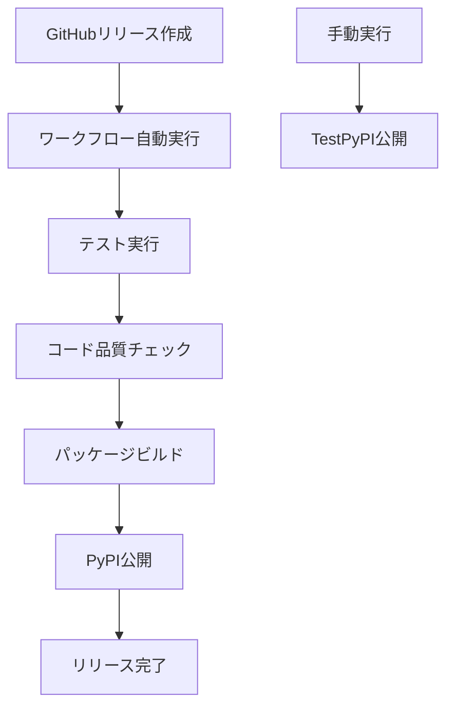

# GitHub リリース手順完全ガイド

## はじめに

このガイドでは、MCP PostgreSQLサーバーのGitHubリリースプロセスについて詳しく説明します。リリースプロセスは自動化されており、GitHub Actionsワークフローを通じてPyPIへのパッケージ公開が行われます。

## リリースプロセスの概要

### 自動リリースフロー


### リリースの種類
1. **本番リリース**: GitHubリリース作成時に自動実行
2. **テストリリース**: 手動実行でTestPyPIへ公開

## リリース前の準備

### 1. バージョン番号の更新

#### セマンティックバージョニング
- **メジャーバージョン**: 後方互換性のない変更
- **マイナーバージョン**: 後方互換性のある新機能
- **パッチバージョン**: バグ修正

#### バージョン更新スクリプト
```bash
# バージョン番号を更新
python scripts/update_version.py --set 1.1.0
```

### 2. 変更履歴の更新

#### CHANGELOG.mdの更新
```markdown
## [1.1.0] - 2025-10-19

### Added
- 新しい機能の追加

### Changed
- 既存機能の変更

### Fixed
- バグ修正
```

### 3. 公開前チェックリストの実行

#### 自動チェックスクリプト
```bash
# 公開前チェックを実行
./scripts/pre_publish_check.sh
```

#### 手動チェック項目
- [ ] すべてのテストが通過する
- [ ] コード品質チェックが完了する
- [ ] ドキュメントが最新である
- [ ] 依存関係に脆弱性がない

## リリース実行手順

### 方法1: GitHubリリース作成（推奨）

#### ステップ1: リリースの作成
1. GitHubリポジトリの「Releases」ページに移動
2. 「Draft a new release」をクリック
3. タグを作成: `v1.1.0`
4. リリースタイトルを入力: `Version 1.1.0`
5. 変更内容を説明に記載
6. 「Publish release」をクリック

#### ステップ2: ワークフローの監視
1. Actionsタブで進行状況を確認
2. 各ジョブの完了を待機
3. エラーが発生した場合はログを確認

### 方法2: 手動実行

#### TestPyPIへの公開
1. Actionsタブの「Publish Python Package」ワークフローを選択
2. 「Run workflow」をクリック
3. ブランチを選択（通常はmain）
4. 「Run workflow」を実行

## ワークフローの詳細

### ジョブの流れ
```yaml
test:           # テスト実行（PostgreSQLサービス使用）
lint:           # コード品質チェック
build:          # パッケージビルド
publish:        # PyPI公開（OIDC認証）
publish-testpypi: # TestPyPI公開（手動実行時のみ）
```

### サービスコンテナ設定
```yaml
services:
  postgres:
    image: postgres:15
    env:
      POSTGRES_USER: postgres
      POSTGRES_PASSWORD: postgres
      POSTGRES_DB: test_db
    ports:
      - 5432:5432
```

### セキュアな公開設定
```yaml
environment: release
permissions:
  id-token: write  # OIDC認証
```

## トラブルシューティング

### 一般的な問題と解決策

#### 1. テスト失敗
**問題**: PostgreSQL接続エラー
```bash
# 解決策: サービスコンテナの確認
docker ps -a
docker logs <container_id>
```

#### 2. ビルドエラー
**問題**: 依存関係の競合
```bash
# 解決策: 依存関係の再同期
uv sync --frozen
```

#### 3. 公開エラー
**問題**: PyPI認証エラー
```yaml
# 解決策: OIDC設定の確認
permissions:
  id-token: write
```

#### 4. バージョン競合
**問題**: 既存バージョンとの競合
```bash
# 解決策: バージョン番号の更新
python scripts/update_version.py --version 1.1.1
```

### デバッグ手法

#### ワークフローログの確認
1. Actionsタブで失敗したワークフローを選択
2. 失敗したジョブをクリック
3. 詳細なログを確認

#### ローカルでの再現
```bash
# ローカル環境でのテスト
docker-compose -f test/docker/docker-compose.test.yml up -d
uv run pytest -v
```

## ベストプラクティス

### 1. リリース前の検証
- ローカル環境での完全なテスト実行
- コード品質チェックの実施
- ドキュメントの更新確認

### 2. 段階的な公開
1. TestPyPIでの検証
2. 本番PyPIへの公開
3. ユーザーへの通知

### 3. ロールバック計画
- 前バージョンのバックアップ
- 緊急修正用のパッチリリース準備

### 4. 監視と通知
- リリース後のパフォーマンス監視
- ユーザーフィードバックの収集
- 問題発生時の迅速な対応

## 高度な設定

### 環境変数の設定

#### GitHub Secretsの設定
1. リポジトリ設定の「Secrets and variables」→「Actions」
2. 必要なシークレットを追加：
   - `PYPI_API_TOKEN`（OIDCを使用する場合は不要）

### カスタムワークフローの作成

#### 開発版リリース
```yaml
name: Publish Development Release

on:
  push:
    branches: [develop]
  workflow_dispatch:

jobs:
  # 開発版用の設定
```

#### プレリリース
```yaml
name: Publish Pre-release

on:
  release:
    types: [prereleased]
```

## セキュリティ考慮事項

### 1. 認証情報の保護
- OIDC認証の使用
- GitHub Secretsの活用
- 最小権限の原則

### 2. コード署名
```yaml
- name: Sign the distribution
  uses: sigstore/gh-action-sigstore-python@v2
  with:
    inputs: ./dist/*.tar.gz
```

### 3. セキュリティスキャン
```yaml
- name: Security scan
  run: uv run bandit -r src/
```

## パフォーマンス最適化

### 1. キャッシュの活用
```yaml
- name: Cache uv dependencies
  uses: actions/cache@v4
  with:
    path: |
      ~/.cache/uv
      .venv
    key: ${{ runner.os }}-uv-${{ hashFiles('**/uv.lock') }}
```

### 2. 並列実行の最適化
```yaml
strategy:
  matrix:
    python-version: ['3.10', '3.11']
```

### 3. リソースの効率化
- 不要なステップの削除
- 適切なタイムアウト設定
- メモリ使用量の最適化

## モニタリングとレポート

### 1. リリースメトリクス
- ビルド時間の追跡
- テストカバレッジの監視
- 公開成功率の測定

### 2. 通知設定
```yaml
- name: Notify on success
  if: success()
  uses: actions/github-script@v7
  with:
    script: |
      // SlackやTeamsへの通知
```

### 3. ダッシュボードの構築
- リリース履歴の可視化
- パフォーマンストレンドの分析
- 問題発生時のアラート

## 参考リソース

- [GitHub Actions 公式ドキュメント](https://docs.github.com/ja/actions)
- [PyPI 公開ガイド](https://packaging.python.org/en/latest/guides/publishing-package-distribution-releases-using-github-actions-ci-cd-workflows/)
- [Semantic Versioning](https://semver.org/)
- [Keep a Changelog](https://keepachangelog.com/)

---

*このガイドは、実際のプロジェクトリリースプロセスに基づいて作成されています。定期的に更新され、最新のベストプラクティスを反映しています。*
