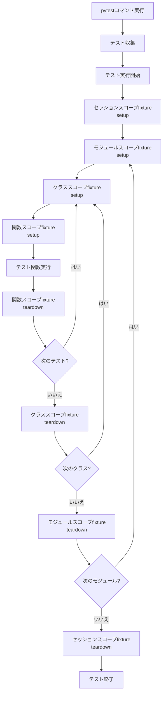
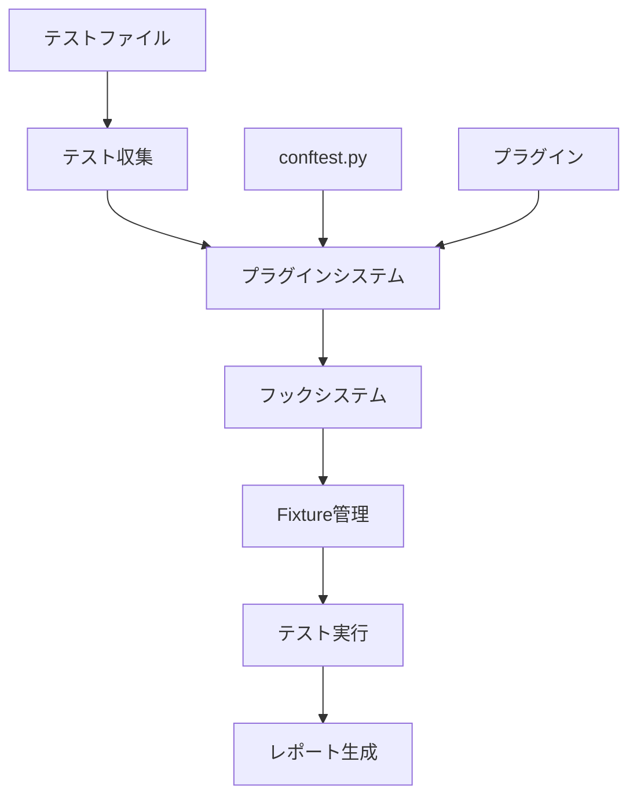
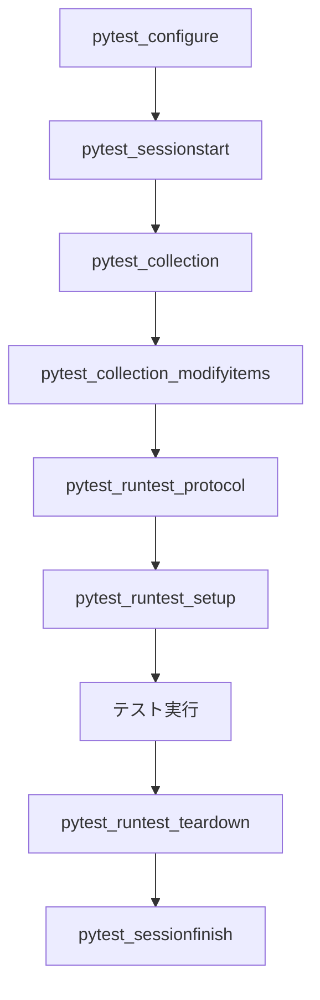

# pytest コンセプトと使い方ガイド

## 目次

### 第1部: pytest入門
1. [pytestとは](#1-pytestとは)
2. [基本的なコンセプト](#2-基本的なコンセプト)
3. [テストの書き方](#3-テストの書き方)

### 第2部: 高度な機能
4. [Fixtureの活用](#4-fixtureの活用)
5. [マーカーとテストの分類](#5-マーカーとテストの分類)
6. [モックとパッチ](#6-モックとパッチ)
7. [パラメータ化テスト](#7-パラメータ化テスト)

### 第3部: テスト実行と管理
8. [テストの実行方法](#8-テストの実行方法)
9. [テストライフサイクル](#9-テストライフサイクル)
10. [ベストプラクティス](#10-ベストプラクティス)

### 第4部: 内部仕組み
11. [pytestの内部仕組み](#11-pytestの内部仕組み)

### 第5部: プロジェクト実践
12. [プロジェクト固有の設定](#12-プロジェクト固有の設定)
13. [トラブルシューティング](#13-トラブルシューティング)

### 付録
- [参考リソース](#参考リソース)

## 1. pytestとは

pytestはPythonのテストフレームワークで、以下の特徴があります：
- **シンプルな構文**: アサーションにPython標準の`assert`文を使用
- **豊富な機能**: fixture、マーカー、パラメータ化など
- **拡張性**: 豊富なプラグインエコシステム
- **詳細なレポート**: 失敗時の詳細な情報提供

## 2. 基本的なコンセプト

### テスト関数
```python
def test_addition():
    assert 1 + 1 == 2

def test_string_concatenation():
    result = "hello" + " world"
    assert result == "hello world"
```

### テストクラス
```python
class TestCalculator:
    def test_addition(self):
        assert 1 + 1 == 2
    
    def test_subtraction(self):
        assert 5 - 3 == 2
```

### アサーション
pytestはPython標準の`assert`文を使用：
```python
def test_complex_assertions():
    # リストの比較
    assert [1, 2, 3] == [1, 2, 3]
    
    # 辞書の比較
    assert {"a": 1, "b": 2} == {"b": 2, "a": 1}
    
    # 例外のテスト
    with pytest.raises(ValueError):
        int("invalid")
```

## 3. テストの書き方

### 基本的なテスト構造
```python
import pytest

def test_functionality():
    # 準備 (Arrange)
    input_data = "test input"
    
    # 実行 (Act)
    result = process_input(input_data)
    
    # 検証 (Assert)
    assert result == expected_output
```

### テストクラスの例
```python
class TestDatabaseOperations:
    def test_create_record(self):
        # テストロジック
        pass
    
    def test_read_record(self):
        # テストロジック
        pass
    
    def test_update_record(self):
        # テストロジック
        pass
    
    def test_delete_record(self):
        # テストロジック
        pass
```

## 4. Fixtureの活用

### 基本的なFixture
```python
import pytest

@pytest.fixture
def sample_data():
    """テスト用のサンプルデータを提供"""
    return {"name": "test", "value": 42}

def test_with_fixture(sample_data):
    assert sample_data["name"] == "test"
    assert sample_data["value"] == 42
```

### スコープ付きFixture
```python
@pytest.fixture(scope="session")
def database_connection():
    """セッション全体で共有されるデータベース接続"""
    conn = create_database_connection()
    yield conn
    conn.close()

@pytest.fixture(scope="function")
def clean_database():
    """各テスト関数の前にデータベースをクリーンアップ"""
    clear_database()
    yield
    clear_database()
```

### 自動使用Fixture
```python
@pytest.fixture(autouse=True)
def setup_test_environment():
    """すべてのテストで自動的に実行されるセットアップ"""
    setup_environment()
    yield
    teardown_environment()
```

## 5. マーカーとテストの分類

### マーカーとは？

**マーカー（marker）** は、テストにメタデータを付与するためのpytestの機能です。テストを分類・グループ化し、実行時の振る舞いを制御するために使用されます。

**マーカーの主な目的**:
- テストの分類とグループ化
- 特定の条件でのテストのスキップ
- テストの実行順序の制御
- テストの属性の定義

### カスタムマーカーの定義
`conftest.py`で定義：
```python
def pytest_configure(config):
    config.addinivalue_line(
        "markers", "integration: mark test as integration test"
    )
    config.addinivalue_line(
        "markers", "slow: mark test as slow running"
    )
```

### マーカーの使用
```python
@pytest.mark.integration
def test_database_connection():
    """統合テスト - 実際のデータベース接続をテスト"""
    pass

@pytest.mark.slow
def test_complex_calculation():
    """時間のかかる計算テスト"""
    pass

@pytest.mark.parametrize("input,expected", [
    (1, 2),
    (2, 4),
    (3, 6)
])
def test_doubling(input, expected):
    """パラメータ化テスト"""
    assert input * 2 == expected
```

### マーカーの実際の使用方法

#### 1. テストの分類と実行
```bash
# 統合テストのみ実行
pytest -m integration

# 統合テストを除外して実行
pytest -m "not integration"

# 複数のマーカーを組み合わせ
pytest -m "integration and not slow"

# いずれかのマーカーを持つテストを実行
pytest -m "integration or slow"
```

#### 2. マーカーによるテストのスキップ
このプロジェクトでは`pytest_collection_modifyitems`でマーカーを使用してテストを自動スキップしています：

```python
def pytest_collection_modifyitems(config, items):
    """環境変数に基づいて統合テストをスキップ"""
    skip_integration = pytest.mark.skip(reason="integration tests require database")
    skip_slow = pytest.mark.skip(reason="slow test skipped by default")
    
    for item in items:
        if "integration" in item.keywords and not os.getenv("RUN_INTEGRATION_TESTS"):
            item.add_marker(skip_integration)
        if "slow" in item.keywords and not os.getenv("RUN_SLOW_TESTS"):
            item.add_marker(skip_slow)
```

**動作の流れ**:
1. pytestがすべてのテストを収集
2. `pytest_collection_modifyitems`が各テストアイテムを検査
3. `integration`マーカーがあり、`RUN_INTEGRATION_TESTS`環境変数が設定されていない場合、スキップマーカーを追加
4. 同様に`slow`マーカーも処理
5. スキップマーカーが付与されたテストは実行されない

#### 3. 組み込みマーカー

pytestには組み込みのマーカーもあります：

```python
@pytest.mark.skip(reason="このテストはまだ実装中です")
def test_in_progress():
    pass

@pytest.mark.skipif(sys.version_info < (3, 8), reason="Python 3.8以上が必要")
def test_python38_feature():
    pass

@pytest.mark.xfail(reason="既知のバグ、修正予定")
def test_known_bug():
    assert False  # 失敗が予想される

@pytest.mark.parametrize("input,expected", [
    (1, 2),
    (2, 4),
    (3, 6)
])
def test_multiple_cases(input, expected):
    assert input * 2 == expected
```

#### 4. マーカーの検証

定義されたマーカーを確認するには：
```bash
pytest --markers
```

**出力例**:
```
@pytest.mark.integration: mark test as integration test (requires database)

@pytest.mark.unit: mark test as unit test (no external dependencies)

@pytest.mark.slow: mark test as slow running

@pytest.mark.skip(reason=None): skip the given test function with an optional reason

@pytest.mark.skipif(condition, ..., *, reason=...): skip the given test function if any of the conditions are true

...
```

#### 5. マーカーのベストプラクティス

1. **明確な目的**: 各マーカーに明確な目的と説明を付与
2. **一貫性**: プロジェクト全体でマーカーの使用方法を統一
3. **適切な粒度**: 必要最小限のマーカーを定義
4. **ドキュメント**: マーカーの使用方法をドキュメント化

#### 6. プロジェクトでのマーカー活用例

このプロジェクトでは以下のマーカーが定義されています：

- **`@pytest.mark.integration`**: 統合テスト（データベース接続が必要）
- **`@pytest.mark.unit`**: ユニットテスト（外部依存なし）
- **`@pytest.mark.slow`**: 時間のかかるテスト

**使用例**:
```python
# test/integration/test_database.py
@pytest.mark.integration
class TestDatabaseConnection:
    def test_connection_success(self, test_database_config):
        # 統合テスト - 実際のデータベースを使用
        pass

# test/unit/test_config.py
class TestPostgresConfig:
    def test_default_values(self):
        # ユニットテスト - 外部依存なし
        pass
```

**実行例**:
```bash
# 統合テストのみ実行（環境変数設定が必要）
set RUN_INTEGRATION_TESTS=1
pytest -m integration -v

# ユニットテストのみ実行
pytest -m unit -v

# 遅いテストを除外して実行
pytest -m "not slow" -v
```

マーカーを使用することで、テストの実行を柔軟に制御し、開発ワークフローを効率化できます。

## 6. モックとパッチ

### unittest.mockの使用
```python
from unittest.mock import patch, MagicMock

def test_with_mock():
    mock_obj = MagicMock()
    mock_obj.method.return_value = "mocked result"
    
    result = function_under_test(mock_obj)
    assert result == "mocked result"

@patch('module.ClassName.method_name')
def test_with_patch(mock_method):
    mock_method.return_value = "patched result"
    
    result = function_under_test()
    assert result == "patched result"
```

### 環境変数のモック
```python
import os
from unittest.mock import patch

@patch.dict(os.environ, {'TEST_VAR': 'test_value'})
def test_with_environment():
    assert os.environ['TEST_VAR'] == 'test_value'
```

## 7. パラメータ化テスト

### 基本的なパラメータ化
```python
import pytest

@pytest.mark.parametrize("input,expected", [
    (1, 2),
    (2, 4),
    (3, 6)
])
def test_doubling(input, expected):
    assert input * 2 == expected
```

### 複数パラメータの組み合わせ
```python
@pytest.mark.parametrize("a", [1, 2])
@pytest.mark.parametrize("b", [3, 4])
def test_multiple_parameters(a, b):
    assert a + b == a + b  # 組み合わせテスト
```

## 8. テストの実行方法

### 基本的な実行
```bash
# すべてのテストを実行
pytest

# 特定のディレクトリのテストを実行
pytest test/unit/

# 特定のファイルのテストを実行
pytest test/unit/test_config.py

# 特定のテストクラスを実行
pytest test/unit/test_config.py::TestPostgresConfig

# 特定のテストメソッドを実行
pytest test/unit/test_config.py::TestPostgresConfig::test_default_values
```

### オプション付き実行
```bash
# 詳細な出力
pytest -v

# カバレッジ計測
pytest --cov=src --cov-report=term-missing

# 特定のマーカーのテストのみ実行
pytest -m integration

# 特定のマーカーを除外
pytest -m "not slow"

# 失敗したテストのみ再実行
pytest --lf

# 最初の失敗で停止
pytest -x
```

### プロジェクト固有の実行スクリプト
このプロジェクトでは`run_tests.bat`と`run_tests.sh`が提供されています：

```bash
# Windows
test\run_tests.bat unit          # ユニットテストのみ
test\run_tests.bat integration   # 統合テストのみ
test\run_tests.bat docker        # Docker環境で実行
test\run_tests.bat all           # 全テスト実行（デフォルト）

# Linux/macOS
test/run_tests.sh unit
test/run_tests.sh integration
test/run_tests.sh docker
test/run_tests.sh all
```

## 9. テストライフサイクル

pytestのテスト実行には明確なライフサイクルがあり、各段階で特定の処理が実行されます。このライフサイクルを理解することで、効率的なテスト設計が可能になります。

### テスト実行の全体フロー



### Fixtureスコープとライフサイクル

pytestのfixtureには4つのスコープがあり、それぞれ異なるライフサイクルを持ちます：

#### 1. 関数スコープ (`scope="function"`) - デフォルト
```python
@pytest.fixture(scope="function")
def function_scoped_fixture():
    """各テスト関数ごとに実行・破棄"""
    print("関数fixture setup")
    yield "function_data"
    print("関数fixture teardown")
```

**ライフサイクル**:
- 各テスト関数の前にsetup
- テスト関数の実行
- 各テスト関数の後にteardown
- **最も頻繁に実行される**

#### 2. クラススコープ (`scope="class"`)
```python
@pytest.fixture(scope="class")
def class_scoped_fixture():
    """テストクラス全体で1回実行・破棄"""
    print("クラスfixture setup")
    yield "class_data"
    print("クラスfixture teardown")
```

**ライフサイクル**:
- テストクラスの最初のテスト前にsetup
- クラス内の全テスト関数を実行
- クラスの最後のテスト後にteardown

#### 3. モジュールスコープ (`scope="module"`)
```python
@pytest.fixture(scope="module")
def module_scoped_fixture():
    """テストモジュール全体で1回実行・破棄"""
    print("モジュールfixture setup")
    yield "module_data"
    print("モジュールfixture teardown")
```

**ライフサイクル**:
- テストモジュールの最初のテスト前にsetup
- モジュール内の全テストを実行
- モジュールの最後のテスト後にteardown

#### 4. セッションスコープ (`scope="session"`)
```python
@pytest.fixture(scope="session")
def session_scoped_fixture():
    """テストセッション全体で1回実行・破棄"""
    print("セッションfixture setup")
    yield "session_data"
    print("セッションfixture teardown")
```

**ライフサイクル**:
- pytest実行時の最初にsetup
- 全テストの実行
- 全テスト終了後にteardown
- **最も効率的なスコープ**

### ライフサイクルの実践例

```python
import pytest

# セッションスコープ - データベース接続など
@pytest.fixture(scope="session")
def database_connection():
    print("🔗 データベース接続確立")
    conn = create_connection()
    yield conn
    conn.close()
    print("🔗 データベース接続終了")

# モジュールスコープ - テストデータの準備
@pytest.fixture(scope="module")
def test_data():
    print("📊 テストデータ準備")
    data = load_test_data()
    yield data
    cleanup_test_data(data)
    print("📊 テストデータクリーンアップ")

# 関数スコープ - 各テストの前処理
@pytest.fixture(scope="function")
def clean_slate():
    print("🧹 テスト前クリーンアップ")
    clear_temporary_data()
    yield
    clear_temporary_data()
    print("🧹 テスト後クリーンアップ")

class TestExample:
    def test_one(self, database_connection, test_data, clean_slate):
        print("✅ test_one 実行")
        assert True

    def test_two(self, database_connection, test_data, clean_slate):
        print("✅ test_two 実行")
        assert True
```

**実行時の出力例**:
```
🔗 データベース接続確立
📊 テストデータ準備
🧹 テスト前クリーンアップ
✅ test_one 実行
🧹 テスト後クリーンアップ
🧹 テスト前クリーンアップ
✅ test_two 実行
🧹 テスト後クリーンアップ
📊 テストデータクリーンアップ
🔗 データベース接続終了
```

### 自動使用fixtureのライフサイクル

`autouse=True`を設定したfixtureは、明示的に要求しなくても自動的に実行されます：

```python
@pytest.fixture(autouse=True, scope="session")
def global_setup():
    """すべてのテストで自動的に実行されるセットアップ"""
    print("🌐 グローバルセットアップ開始")
    setup_global_environment()
    yield
    teardown_global_environment()
    print("🌐 グローバルセットアップ終了")

@pytest.fixture(autouse=True, scope="function")
def per_test_setup():
    """各テストで自動的に実行されるセットアップ"""
    print("📝 テスト前セットアップ")
    yield
    print("📝 テスト後クリーンアップ")
```

### ライフサイクルの制御

#### 依存関係の制御
```python
@pytest.fixture
def user_data():
    return {"name": "test_user"}

@pytest.fixture
def authenticated_user(user_data):  # user_dataに依存
    return authenticate_user(user_data)

def test_with_dependencies(authenticated_user):
    # authenticated_userが先にuser_dataを要求
    assert authenticated_user.is_authenticated
```

#### 順序の制御
```python
@pytest.fixture
def first_fixture():
    print("1番目のfixture")
    return "first"

@pytest.fixture
def second_fixture(first_fixture):  # first_fixtureの後に実行
    print("2番目のfixture")
    return f"second with {first_fixture}"
```

### プロジェクトでのライフサイクル活用例

このプロジェクトの`conftest.py`では以下のライフサイクルが定義されています：

```python
# セッションスコープ - テスト全体で1回
@pytest.fixture(scope="session")
def event_loop():
    """非同期テスト用のイベントループ"""
    loop = asyncio.get_event_loop_policy().new_event_loop()
    yield loop
    loop.close()

# セッションスコープ - データベース設定
@pytest.fixture(scope="session")
def test_database_config():
    """テスト用データベース設定"""
    return {
        "host": os.environ["POSTGRES_HOST"],
        "port": int(os.environ["POSTGRES_PORT"]),
        "database": os.environ["POSTGRES_DB"],
        "username": os.environ["POSTGRES_USER"],
        "password": os.environ["POSTGRES_PASSWORD"],
        "ssl_mode": os.environ["POSTGRES_SSL_MODE"],
    }

# 自動使用 - 各テストで実行
@pytest.fixture(autouse=True)
def setup_test_environment():
    """各テストの環境設定"""
    # テスト前処理
    yield
    # テスト後処理
```

### test_database_config fixtureの詳細

統合テストファイル（`test/integration/test_database.py`）で使用されている`test_database_config` fixtureは、以下のように動作します：

**定義場所**: `test/conftest.py`
**スコープ**: `session`（テストセッション全体で1回のみ初期化）
**初期化タイミング**: pytest実行時の最初

**環境変数からの設定値**:
```python
# conftest.pyでの環境変数設定
os.environ["POSTGRES_HOST"] = os.getenv("POSTGRES_HOST", "localhost")
os.environ["POSTGRES_PORT"] = os.getenv("POSTGRES_PORT", "5433")
os.environ["POSTGRES_DB"] = os.getenv("POSTGRES_DB", "mcp_test_db")
os.environ["POSTGRES_USER"] = os.getenv("POSTGRES_USER", "test_user")
os.environ["POSTGRES_PASSWORD"] = os.getenv("POSTGRES_PASSWORD", "test_password")
os.environ["POSTGRES_SSL_MODE"] = os.getenv("POSTGRES_SSL_MODE", "disable")
```

**統合テストでの使用方法**:
```python
# test/integration/test_database.py
def test_connection_success(self, test_database_config):
    """test_database_config fixtureを使用"""
    config = PostgresConfig(**test_database_config)
    connection = DatabaseConnection(config)
    
    result = connection.test_connection()
    assert result is True
```

**ライフサイクルの流れ**:
1. pytest実行時に`test_database_config` fixtureが1回だけ初期化
2. 環境変数からデータベース接続設定を読み込み
3. 統合テストでこのfixtureを要求すると、キャッシュされた値が返される
4. テスト終了後にfixtureは自動的に破棄されない（sessionスコープのため）

この設計により：
- **効率性**: 重いデータベース設定の読み込みが1回のみ
- **一貫性**: すべての統合テストで同じ設定を使用
- **保守性**: 設定変更は1箇所（conftest.py）のみで対応可能

### ライフサイクルのベストプラクティス

1. **適切なスコープの選択**:
   - 重いリソースは`session`スコープ
   - テスト間で共有するデータは`module`スコープ
   - 独立したテストデータは`function`スコープ

2. **依存関係の最小化**:
   - 必要なfixtureのみを要求
   - 循環依存を避ける

3. **クリーンアップの確実性**:
   - `yield`ステートメントを使用
   - 例外時も確実にクリーンアップされることを確認

4. **パフォーマンス考慮**:
   - 高コストな操作は上位スコープで実行
   - 軽量な操作は下位スコープで実行

このライフサイクルの理解により、効率的で保守性の高いテストスイートを構築できます。

## 10. ベストプラクティス

### テスト設計
1. **単一責任**: 各テストは1つのことをテストする
2. **明確な名前**: テスト名は何をテストするか明確に
3. **AAAパターン**: Arrange（準備）、Act（実行）、Assert（検証）
4. **独立性**: テストは互いに依存しない

### テスト構造
```python
def test_functionality_clear_structure():
    # Arrange - テストの準備
    input_data = prepare_test_data()
    expected_output = calculate_expected()
    
    # Act - テスト対象の実行
    actual_output = function_under_test(input_data)
    
    # Assert - 結果の検証
    assert actual_output == expected_output
```

### エラーハンドリング
```python
def test_exception_handling():
    # 例外が発生することをテスト
    with pytest.raises(ValueError) as exc_info:
        function_that_raises_value_error()
    
    # 例外メッセージの検証
    assert "expected error message" in str(exc_info.value)
```

### テストの保守性
- 重複コードはfixtureに抽出
- 複雑なセットアップはヘルパー関数に分離
- マジックナンバーは定数として定義

## 11. pytestの内部仕組み

### アーキテクチャ概要

pytestは以下の主要コンポーネントで構成されています：



### 1. テスト収集の仕組み

pytestは以下の手順でテストを収集します：

#### ファイル探索
```python
# pytestの内部的なファイル探索ロジック
def collect_tests(rootdir):
    for file in discover_files(rootdir):
        if is_test_file(file):
            module = import_module(file)
            for item in discover_test_items(module):
                yield item
```

#### テストアイテムの識別
- `test_`で始まる関数
- `Test`で始まるクラス内の`test_`で始まるメソッド
- `conftest.py`ファイル内のfixture

**収集プロセスの詳細**:
1. **ディレクトリ走査**: 指定されたパスを再帰的に探索
2. **ファイルフィルタリング**: `test_*.py`や`*_test.py`パターンに一致するファイルを特定
3. **モジュールインポート**: テストファイルをPythonモジュールとしてインポート
4. **テストアイテム抽出**: モジュール内からテスト関数とクラスを抽出
5. **Fixture収集**: `conftest.py`ファイルからfixtureを収集

### 2. プラグインシステム

pytestは強力なプラグインシステムを持っています：

#### プラグインの種類
- **内置プラグイン**: pytest本体に組み込まれた機能
- **外部プラグイン**: `pytest-`プレフィックスでインストール
- **ローカルプラグイン**: `conftest.py`や`pytest_plugins`で定義

#### プラグインのロード順序
```python
# 内部的なプラグインロード順序
def load_plugins():
    # 1. 内置プラグインのロード
    load_builtin_plugins()
    
    # 2. 設定ファイルからのプラグインロード
    load_ini_plugins()
    
    # 3. コマンドラインからのプラグインロード
    load_cmdline_plugins()
    
    # 4. conftest.pyからのプラグインロード
    load_conftest_plugins()
```

### 3. フックシステム

pytestはイベント駆動アーキテクチャを採用しており、フック関数を通じて動作をカスタマイズできます：

#### 主要なフックポイント
```python
# pytest_configure: 設定の初期化
def pytest_configure(config):
    config.addinivalue_line("markers", "integration: integration test")

# pytest_collection_modifyitems: テスト収集後の修正
def pytest_collection_modifyitems(config, items):
    for item in items:
        if should_skip(item):
            item.add_marker(pytest.mark.skip)

# pytest_runtest_setup: テスト実行前のセットアップ
def pytest_runtest_setup(item):
    print(f"Setting up: {item.name}")

# pytest_runtest_teardown: テスト実行後のクリーンアップ
def pytest_runtest_teardown(item):
    print(f"Tearing down: {item.name}")
```

#### フックの実行順序


### 4. Fixtureシステムの仕組み

#### Fixtureの解決と注入
```python
# 内部的なfixture解決ロジック
def resolve_fixtures(test_function, fixture_names):
    fixtures = {}
    
    for name in fixture_names:
        # 1. fixtureの定義を探索
        fixture_def = find_fixture_definition(name)
        
        # 2. 依存関係を解決
        dependencies = resolve_fixture_dependencies(fixture_def)
        
        # 3. fixtureを実行
        if fixture_def.scope == "function":
            result = execute_function_fixture(fixture_def, dependencies)
        elif fixture_def.scope == "session":
            result = get_cached_session_fixture(fixture_def, dependencies)
            
        fixtures[name] = result
    
    return fixtures
```

#### Fixtureキャッシュの仕組み
```python
# セッションスコープfixtureのキャッシュ管理
class FixtureCache:
    def __init__(self):
        self._cache = {}
    
    def get_fixture(self, fixture_def, dependencies):
        cache_key = self._create_cache_key(fixture_def, dependencies)
        
        if cache_key not in self._cache:
            # fixtureを初回実行
            result = execute_fixture(fixture_def, dependencies)
            self._cache[cache_key] = result
        
        return self._cache[cache_key]
```

### 5. アサーションの書き換え

pytestは`assert`文を詳細なエラーメッセージに書き換えます：

#### 元のコード
```python
def test_example():
    result = some_function()
    assert result == expected_value
```

#### 内部的に書き換えられたコード
```python
def test_example():
    result = some_function()
    if not (result == expected_value):
        # 詳細なエラーメッセージを生成
        raise AssertionError(
            f"assert {result} == {expected_value}\n"
            f"  values: {result} != {expected_value}"
        )
```

### 6. マーカーシステムの仕組み

#### マーカーの内部表現
```python
# 内部的なマーカー表現
class Marker:
    def __init__(self, name, args=None, kwargs=None):
        self.name = name
        self.args = args or ()
        self.kwargs = kwargs or {}
    
    def __contains__(self, item):
        return item.keywords.get(self.name) is not None
```

#### マーカーフィルタリング
```python
def filter_tests_by_marker(items, marker_expression):
    filtered = []
    
    for item in items:
        if evaluate_marker_expression(item, marker_expression):
            filtered.append(item)
    
    return filtered

def evaluate_marker_expression(item, expression):
    # "integration and not slow" のような式を評価
    return eval_marker_ast(parse_marker_expression(expression), item.keywords)
```

### 7. パラメータ化の仕組み

#### パラメータ化の内部処理
```python
# @pytest.mark.parametrizeの内部実装
def parametrize_decorator(argnames, argvalues):
    def decorator(function):
        # 元の関数を複製してパラメータごとのテスト関数を作成
        test_functions = []
        
        for i, values in enumerate(argvalues):
            # 新しいテスト関数を作成
            new_function = create_parametrized_function(
                function, argnames, values, i
            )
            test_functions.append(new_function)
        
        return test_functions
    
    return decorator
```

### 8. レポートシステム

#### レポートの生成フロー
```python
def generate_test_report(test_item, outcome, duration, error=None):
    report = TestReport(
        nodeid=test_item.nodeid,
        outcome=outcome,
        duration=duration,
        when="call"
    )
    
    if error:
        report.longrepr = format_error_message(error)
    
    return report
```

#### レポートの集約
```python
class ReportCollector:
    def __init__(self):
        self.reports = []
    
    def process_report(self, report):
        self.reports.append(report)
        
        # レポートをすべての登録済みレポーターに送信
        for reporter in self.reporters:
            reporter.process_report(report)
```

### 9. 非同期テストのサポート

#### 非同期テストの実行
```python
async def run_async_test(test_function, fixture_values):
    # 非同期fixtureの解決
    async_fixtures = {}
    for name, fixture_def in fixture_definitions.items():
        if is_async_fixture(fixture_def):
            async_fixtures[name] = await execute_async_fixture(fixture_def)
    
    # 非同期テストの実行
    if is_async_function(test_function):
        await test_function(**fixture_values, **async_fixtures)
    else:
        test_function(**fixture_values, **async_fixtures)
```

### 10. 設定システム

#### 設定の優先順位
```python
def load_configuration():
    config = {}
    
    # 1. 内置デフォルト値
    config.update(DEFAULT_CONFIG)
    
    # 2. pytest.iniからの設定
    config.update(load_ini_config())
    
    # 3. pyproject.tomlからの設定
    config.update(load_pyproject_config())
    
    # 4. コマンドライン引数
    config.update(parse_command_line_args())
    
    return config
```

この内部仕組みの理解により、pytestの動作を深く理解し、より効果的なテスト戦略を立てることができます。

## 12. プロジェクト固有の設定

### conftest.pyの役割
このプロジェクトの`test/conftest.py`では以下の設定が行われています：

1. **テスト環境変数の設定**
   ```python
   os.environ["POSTGRES_HOST"] = os.getenv("POSTGRES_HOST", "localhost")
   os.environ["POSTGRES_PORT"] = os.getenv("POSTGRES_PORT", "5433")
   # ... その他の環境変数
   ```

2. **イベントループの設定**（非同期テスト用）
   ```python
   @pytest.fixture(scope="session")
   def event_loop():
       loop = asyncio.get_event_loop_policy().new_event_loop()
       yield loop
       loop.close()
   ```

3. **データベース設定fixture**
   ```python
   @pytest.fixture(scope="session")
   def test_database_config():
       return {
           "host": os.environ["POSTGRES_HOST"],
           "port": int(os.environ["POSTGRES_PORT"]),
           # ... その他の設定
       }
   ```

4. **環境設定fixture**
   ```python
   @pytest.fixture(autouse=True)
   def setup_test_environment():
       # テスト前の設定
       yield
       # テスト後のクリーンアップ
   ```

5. **カスタムマーカーの定義**
   ```python
   def pytest_configure(config):
       config.addinivalue_line("markers", "integration: mark test as integration test")
       config.addinivalue_line("markers", "unit: mark test as unit test")
       config.addinivalue_line("markers", "slow: mark test as slow running")
   ```

   **pytest_configureの呼び出しタイミング**:
   - **自動呼び出し**: pytestフレームワークによってテスト実行の初期化段階で自動的に呼び出される
   - **呼び出し元**: pytestの内部フレームワーク
   - **タイミング**: テスト収集の前、プラグインの初期化後
   - **目的**: pytestの設定をカスタマイズするためのフック関数

   **pytestフック関数のライフサイクル**:
   ```mermaid
   flowchart TD
       A[pytestコマンド実行] --> B[プラグイン初期化]
       B --> C[pytest_configure呼び出し]
       C --> D[テスト収集開始]
       D --> E[pytest_collection_modifyitems呼び出し]
       E --> F[テスト実行]
   ```

6. **テストの自動スキップ**
   ```python
   def pytest_collection_modifyitems(config, items):
       # 環境変数に基づいて統合テストをスキップ
       skip_integration = pytest.mark.skip(reason="integration tests require database")
       for item in items:
           if "integration" in item.keywords and not os.getenv("RUN_INTEGRATION_TESTS"):
               item.add_marker(skip_integration)
   ```

### プロジェクトのテスト構造
```
test/
├── conftest.py           # 共有fixtureと設定
├── unit/                 # ユニットテスト
│   ├── test_config.py    # 設定クラスのテスト
│   └── ...              # その他のユニットテスト
├── integration/          # 統合テスト
│   ├── test_database.py  # データベース操作のテスト
│   └── ...              # その他の統合テスト
├── docker/              # Dockerテスト環境
│   ├── docker-compose.test.yml
│   ├── Dockerfile.test
│   └── init-test-db.sql
└── docs/                # テストドキュメント
    ├── pytest_concepts_and_usage.md  # このファイル
    └── run_tests_bat_explanation.md
```

### テスト実行のワークフロー

1. **開発中のクイックテスト**
   ```bash
   pytest test/unit/ -v
   ```

2. **統合テストの実行**
   ```bash
   # 環境変数を設定して統合テストを有効化
   set RUN_INTEGRATION_TESTS=1
   pytest test/integration/ -v
   ```

3. **包括的なテスト**
   ```bash
   # スクリプトを使用して全テストを実行
   test\run_tests.bat all
   ```

4. **Docker環境でのテスト**
   ```bash
   test\run_tests.bat docker
   ```

## 13. トラブルシューティング

### よくある問題と解決策

1. **Fixtureが見つからない**
   - `conftest.py`が正しい場所にあるか確認
   - fixtureのインポートパスを確認

2. **モジュールのインポートエラー**
   - `PYTHONPATH`が正しく設定されているか確認
   - 相対インポートのパスを確認

3. **データベース接続エラー**
   - テスト用データベースが起動しているか確認
   - 環境変数が正しく設定されているか確認

4. **非同期テストのエラー**
   - イベントループが正しく設定されているか確認
   - `@pytest.mark.asyncio`デコレータの使用を検討

## 参考リソース

- [pytest公式ドキュメント](https://docs.pytest.org/)
- [unittest.mockドキュメント](https://docs.python.org/3/library/unittest.mock.html)
- [pytest-covプラグイン](https://pytest-cov.readthedocs.io/)
- [pytest-asyncioプラグイン](https://pytest-asyncio.readthedocs.io/)

このガイドがpytestの効果的な使用に役立つことを願っています！
